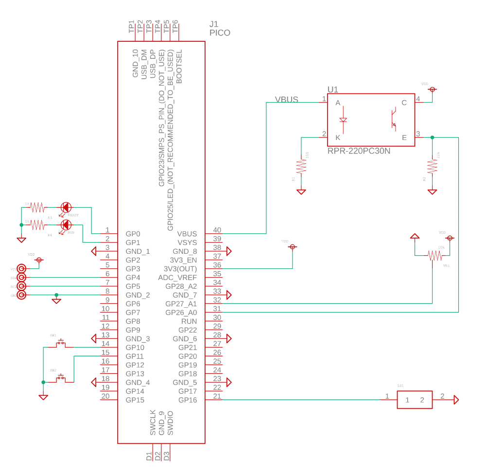
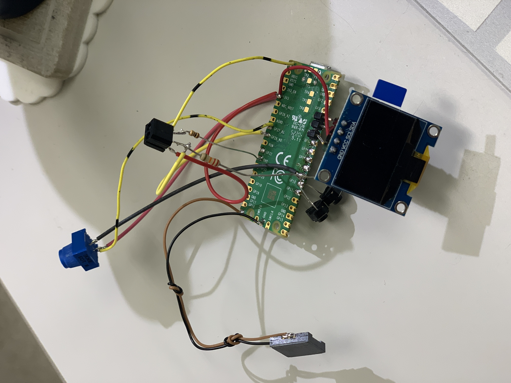
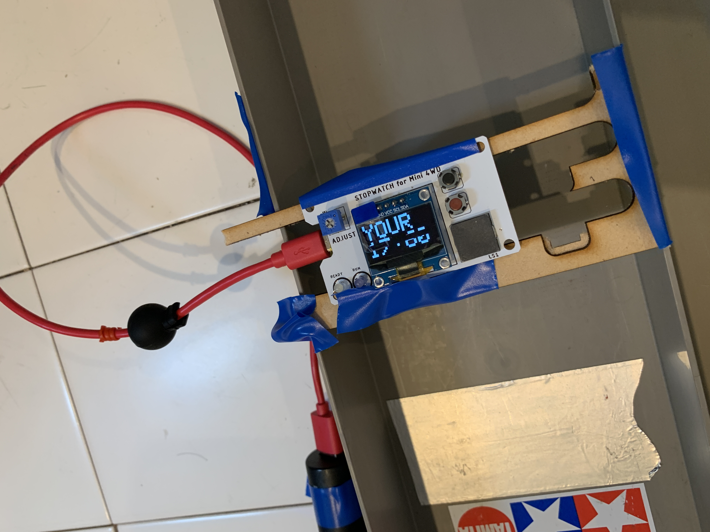

# RP2040(いわいるRasPico)で、お手軽に（＝なるだけ時間をかけずに）実用(!?)なモノを作る。

## スタート／ストップ計測装置（苦笑）

- 公式→[Arduino-Pico](https://arduino-pico.readthedocs.io/en/latest/index.html)
- 伯爵版→[earlephilhower/arduino-pico
](https://github.com/earlephilhower/arduino-pico)
- [有機ELディスプレイ](https://akizukidenshi.com/catalog/g/gP-12031/)

## 仕様
- スタートを検出し、時間計測開始
- もう一度検出したら、時間計測終了

## なので以下の機能をまず実装
- ボタン（押すと、スタート検出待ちになる）
- 反射型フォトセンサ（距離検出して、それをスタートとする）
- ↑の閾値用にアナログ入力で抵抗で分圧した電圧を測る
- 表示装置にI2CのLCDを仕様。

## いきなりつまずく

　なんかこのボードをarduinoで使うのはいまいちな感じだった。
公式の環境がやる気ないらしい→[Raspberry Pi Picoの2つのArduinoサポートを比較](https://lipoyang.hatenablog.com/entry/2021/11/27/202142)

伯爵版を焼いたら次回USBが認識しなくなった（毎回ボタン押ししてUSB刺すハメに。。。）公式版で、ピンアサインに合わせることにする（I2CはGP4,GP5だった←setSDAとかコンパイルできないし。。。）
スキャナー動かして、とりあえずOLEDを認識、

## でタイマを使うに当たって、伯爵版へ戻る

　公式のタイマが使えないのでWEB漁って、伯爵版のタイマを使ってみる。結局
毎回焼くときにボタン押しして刺しなおすハメになる。。。orz

## 実装に当たっての参考Link

- I2Cを使う→[Raspberry Pi Picoでプログラミング ⑦ 使用するピンと機能](https://www.denshi.club/parts/2021/04/raspberry-pi-pico-6.html)
- 有機ELディスプレイ表示→[arduinoで有機ELディスプレイ(2)
SSD1306でHello,WorldとLチカ](https://country-programmer.dfkp.info/2021/08/oled_ssd1306_002/)

- センサ→  [[RPR-220]反射型フォトセンサを使ってみる](http://nanoappli.com/blog/archives/5051)

- 1msecのタイマ→[Arduino IDEでラズパイ・ピコ：1msタイマー割り込み](http://igarage.cocolog-nifty.com/blog/2022/04/post-0517b2.html)

## 板を起こしてみたよ

## 板をおこすまでに、バラックでデバッグしたよ

## 実使用に当たって

- ミニ4駆が早すぎて、スタートストップの検出に失敗する。仕方がないので紙をカーテンのように張り付けて検出するようにした。
- 支えの板を現地調達したので、超ダサい（今度は3Dプリンタで支えを作る。
- 子供が押しまくってボタンが壊れた（はんだで応急修理、ちょっと機構的にはヤワだし、修理しにくい構造は×だった。

