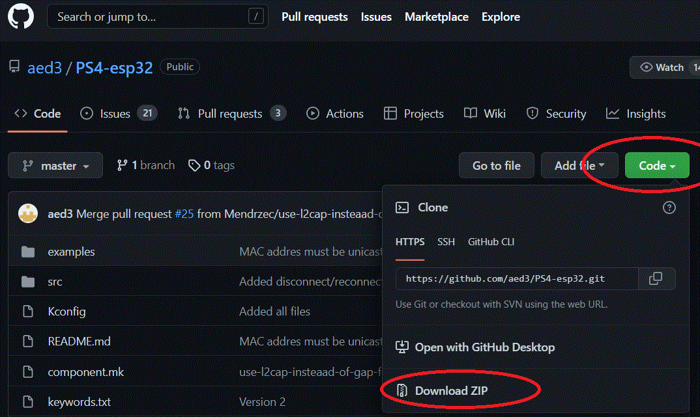
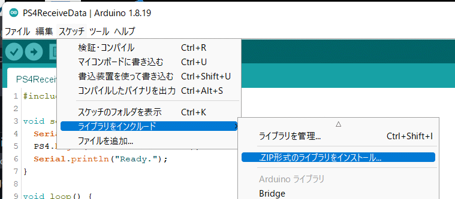
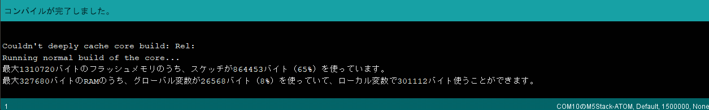
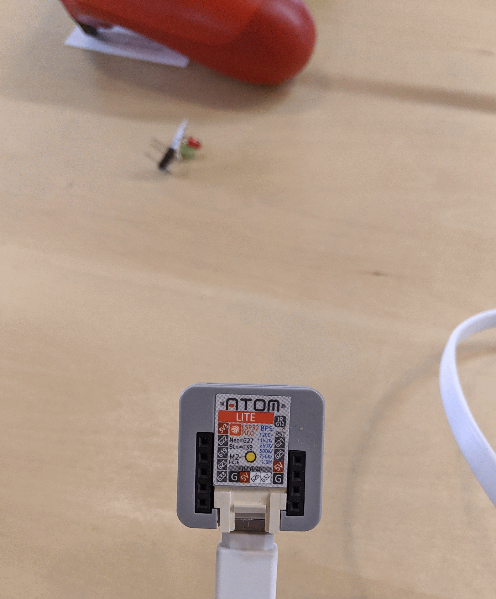
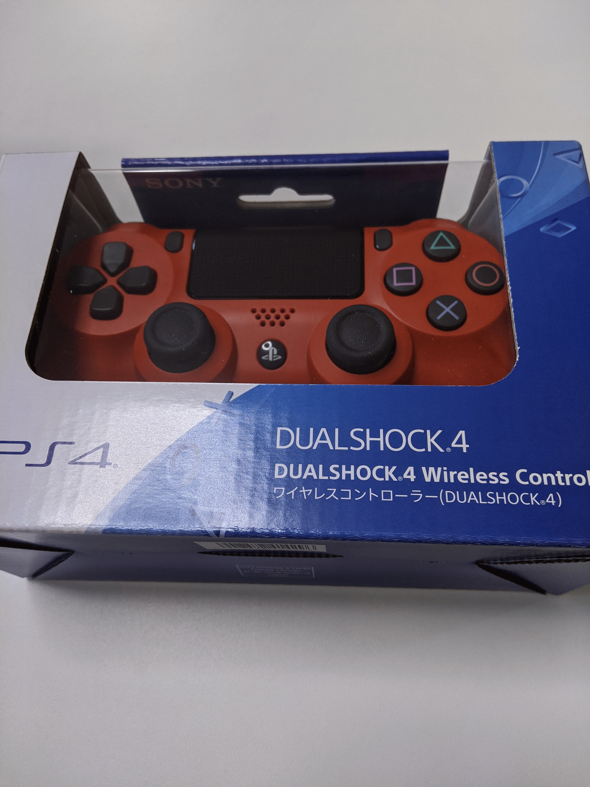

# M5ATOMでDualShock4を動かす

遠隔操作のためのコントローラにこれを使ってみる（ので、参考リンクの通りに動かしてみる）

## 参考リンク
M5ATOMでDUALSHOCK4を使う（2022年版）　[MCU]→
https://j-7system.blog.ss-blog.jp/2022-05-08

## 作業ログ

サンプルPS4ReceiveData.inoをイゴかす

- 前提としてm5atomの公式のボードとライブラリがインストール済で、#include "M5Atom.h"の記述のあるサンプルが動作する。
- で、コントローラは買ってきて、何もせずにまず充電した→満充電でランプが消灯

1. まずライブラリをインストール（https://github.com/aed3/PS4-esp32 ）→ZIPに固めてダウンロードする

2. ino開いて、スケッチからのZIPインストールする

3. ビルドすると一応ビルドできた!!

1. とりあえずPCとつなぐ。SHARE+PSでペアリングモードになるので（白色で短く2点滅する）PCで見つけてつなぐとあっさりWireless コントローラとして接続される。
2. https://qiita.com/Geek493/items/8402ad875b88822e75ab を参考にAROMのMACを調査する→サンプルのスケッチを動かす。
3. サンプルコードにもMACアドレスを書き込むぁゃιぃツールを落としてきて、さっき調べたMACを書き込む（最初のリンクを参考に2度書きする）
4. サンプルコードにもさっき調べたMACアドレスを書き込む→PS4.begin("ここ");
5. 書き込んでシリアル開いて、で、PSの電源を入れるとうまく動いた!!

## モノはこちら

