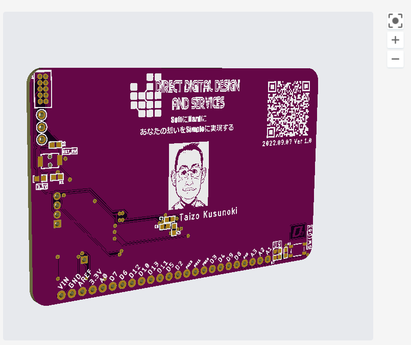

# 名刺基板

　イベント用に名刺代わりとなる基板を作る。で、作りたかったatsam（＝arm）系のArduino基板Cloneを起こしてみる

## 参照資料

- まずはSimulinkで使える（かつ自分が所有する2017bに対応する）arm系のCPUを探した（ATMEGA2560はすでに作ったのでPASS）
- https://jp.mathworks.com/hardware-support/arduino-matlab.html
から、Arduino Dueがよかったんだけど、裸のCPUが手に入らない(2022.09時点)のと塩梅してArduino MKR1000を調べ始める
- https://elchika.com/dic/Arduino_MKR_1000/
から使用CPUモジュールはATSAMW25（←買えるけどめっちゃ高い）で、中には
Atmel SAMD21G18が入っているらしい、で、ビンゴ→
https://akizukidenshi.com/catalog/g/gI-09837/
- なので、[このへん](https://www.sparkfun.com/products/13664)からEagleファイルを落としてきて改造、自分の部品に乗っけ変えて仕上げる
- arduino用の bootloaderは
http://blog.eldhrimnir.com/?p=5293
見て焼く予定（j-link経由で焼く予定）

## 部品表
（そのうち書く）

## ハードデバッグおよびbootloader焼き焼きについて
（そのうち書く）

## 作業ログ

- 2022.09.03 [MakerFair2022](https://makezine.jp/event/mft2022/)に参加、話しかけるネタがほしくなり名刺基板を所望する
- 2022.09.05 作業開始
- 2022.09.07 JLPCBに発注（基板は666円、送料(OCS Express)980円）

## ポストアンブル
お仕事募集中（はぁ～と）

