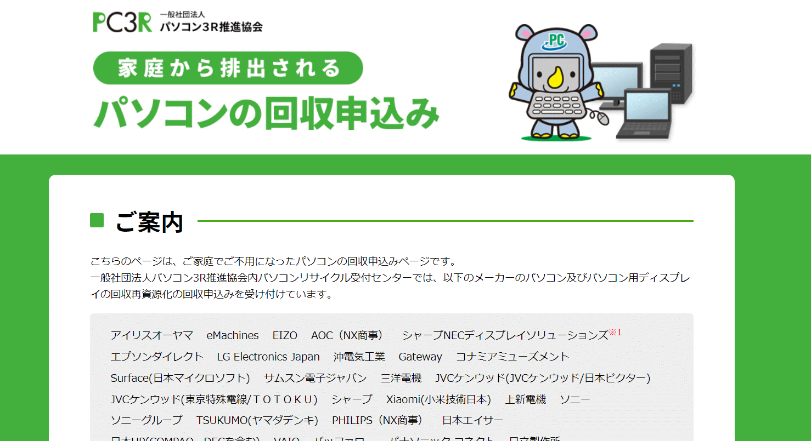

# 古いLCDをリサイクルに出す
 
## 昔使っていた（今も使えるんだけど）LCDをリサイクルに出す。

モノはLGのディスプレイ（2011年に購入）、リサイクルのサイトに対応メーカーとしてちゃんと記載されているLG。怪しい業者に送りつけて処分してもらうのではなく、ちゃんとメーカ（と御上）に則った方法で処分してみる。

 

## 時系列ログ

- 2022.08.16:WEBにて申し込む（リサイクルマークはなかったのだけど、機種名を入れると自動的にリサイクルマーク対象と判別された＝お金は向こう持ち💛）
- 2022.0817:受付完了のお知らせメール届く（輸送伝票を、１週間以内目途に発送いたします。との旨）
- 2022.08.21:伝票到着
 
- 2022.08.27:梱包して郵便局に持ち込む

梱包の方法だが、わざわざ段ボールに入れずにただビニールに包むだけでよいと書いてある。

 

で、近くの郵便局に持ち込む。
領収書類を作ってもらうのに5分ほど待たされるが、

 
しかし、これでもうLCDは処分された（完

## 感想
以外に簡単に（お金もかからず）処分できた。

