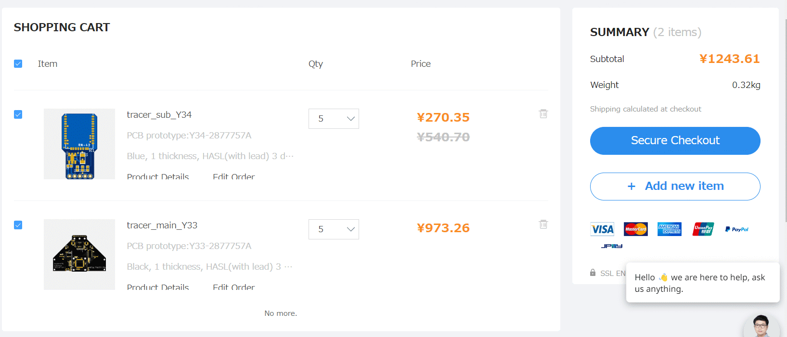

# ロボトレーサを作る 
 
## プリアンブル

　運命に引き寄せらるがごとく、ロボトレーサを作ることにする。ちょうどネット上で倒立振子を作っている人(
[かーたーさん](https://qiita.com/Carter)）をフォローして、真似してモノを作ろうとしていたところ、買ったモータがよく観れば大御所[アニキ](http://anikinonikki.cocolog-nifty.com/blog/)の[トレーニングトレーサー](https://github.com/rt-net/TrainingTracer_Hardware)と同形状じゃないですか？　これを**運命**と言わずになんというのだろう。とりあえずarduino megaで試作したら、マイクロマウサー向けのmatlabライセンス（**ヴィジュアル言語に絶対に手を出すなっとじっちゃに言われているのに**）を申請して、電源ベース3.3VでESP32でもう一回作ろうっと!!

## ブロック図を書いて構想を練る

 

## 勢いで回路図書いて発注しちゃう

 
- 前回作った倒立振子用のATMEGA基板でSimulink関係のデバッグを終え、とりあえずそれをコピペして作ってみた。やっつけで作ったので後はハードデバッグしながら進める
- あとATMEGAはDTRでリセットをかける知見を得たので、BT経由でDTRを操作できる(←こちらも実ハードで確認した、ただしモジュールが一個しかない。。。)RN42の焼き焼き基板も作ってみる。これがうまく動けば、無線エクスターナルモードが出来て非常に楽しくなる（はたしてうまく行くか。。。）
 
- 相変わらずJLPCB（円安にも負けず）安い。次はPCBAまで挑戦したい（CADはJLPCB提供のツールを使ってみる）

## 作業LOG

- 2022.0627:秋月で部品だけ発注
- 2022.0628:このログを描き始めて、ちょっとしたブロック図を書く
- (NEW!)2022.07.21:回路図書いてレイアウトして発注しちゃう

## おわりに

　みんなアニキ大好き💛
