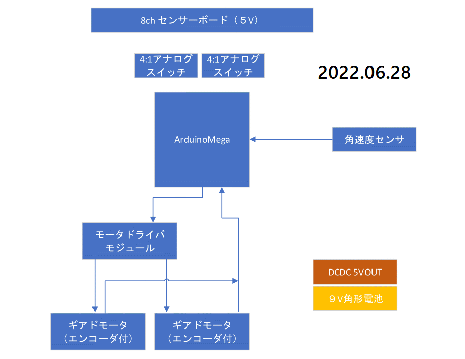

# ロボトレーサを作る 
 
## プリアンブル

　運命に引き寄せらるがごとく、ロボトレーサを作ることにする。ちょうどネット上で倒立振子を作っている人(
[かーたーさん](https://qiita.com/Carter)）をフォローして、真似してモノを作ろうとしていたところ、買ったモータがよく観れば大御所[アニキ](http://anikinonikki.cocolog-nifty.com/blog/)の[トレーニングトレーサー](https://github.com/rt-net/TrainingTracer_Hardware)と同形状じゃないですか？　これを**運命**と言わずになんというのだろう。とりあえずarduino megaで試作したら、マイクロマウサー向けのmatlabライセンス（**ヴィジュアル言語に絶対に手を出すなっとじっちゃに言われているのに**）を申請して、ベース3.3VでESP32でもう一回作ろうっと!!

## ブロック図を書いて構想を練る

 

## 作業LOG

- 2022.0627:秋月で部品だけ発注
- 2022.0628:このログを描き始めて、ちょっとしたブロック図を書く

## おわりに

　みんなアニキ大好き💛
